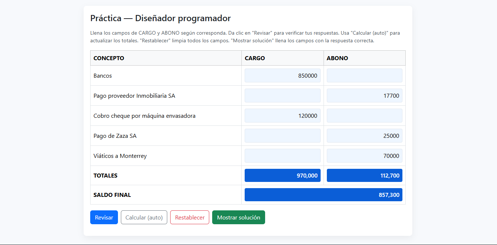

# Prueba técnica — Diseñador Programador (EBC)

Este repositorio contiene mi entrega de la **prueba técnica** para el puesto de Diseñador Programador en la Escuela Bancaria y Comercial (EBC).

---

## 📌 Descripción
La aplicación es una tabla interactiva hecha en **HTML, CSS y JavaScript** que permite:

- Introducir los montos en columnas de **Cargo** y **Abono**.
- Calcular automáticamente los **totales** y el **saldo final (Cargo − Abono)**.
- Validar los valores contra los esperados, mostrando aciertos en verde y errores en rojo.
- Mostrar la **solución completa** con un botón adicional.
- Restablecer la tabla para volver a intentarlo.

---

## 🚀 Tecnologías usadas
- **HTML5** → estructura de la tabla.  
- **CSS3 (Bootstrap + estilos propios)** → diseño y retroalimentación visual.  
- **JavaScript (Vanilla)** → lógica de parseo, cálculos y validación.  

---

## 📷 Vista previa de la aplicación



## 🖥️ Cómo usar
1. Descargar o clonar este repositorio.  
   ```bash
   git clone https://github.com/TU-USUARIO/prueba-tecnica-ebc.git
